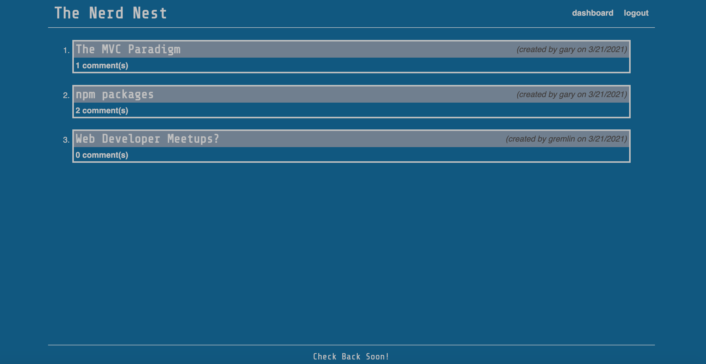
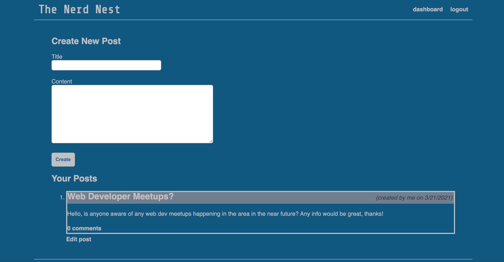
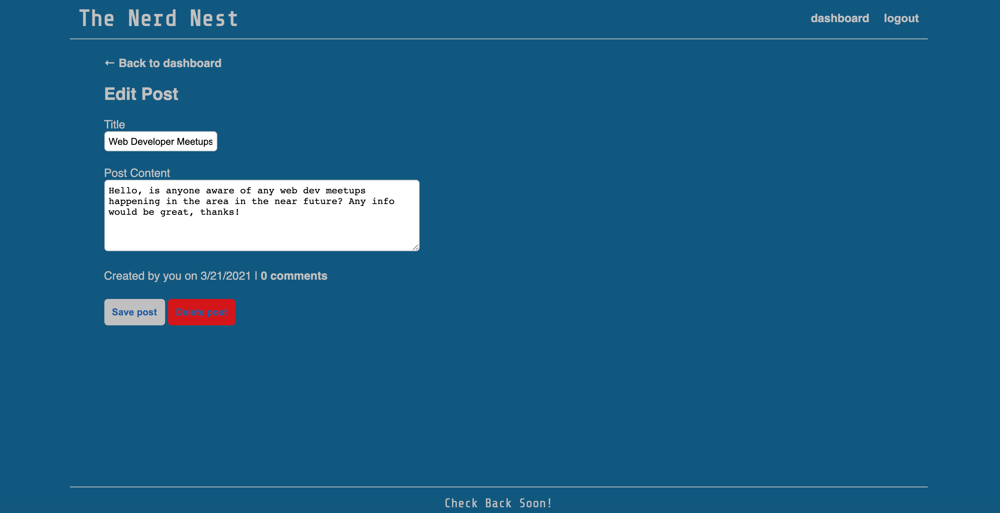
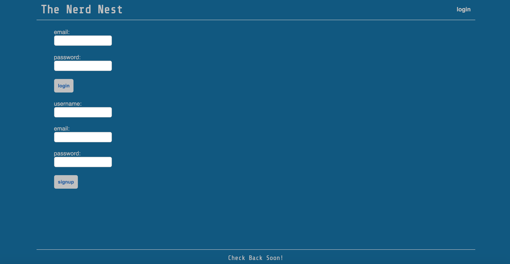

  # The Nerd Nest
  

  
  ## Description: 

  The Nerd Best is a CMS-style blog site built following the MVC paradigm. It allows a user to sign up or log in to their account, create/edit/delete their own blog posts, and also comment on blog posts that others have contributed. The app was created primarily utilizing Express.js for server-side implementation including controllers/API, the express-session nmp package for authentication, Handlebars.js for views, and MySQL and Sequelize for the ORM. The npm packages dotenv and bcrypt were also used for environment variables and password hashing respectively. 

  
  

   

  ## Table of Contents:
  * [Installation](#installation)
  * [Usage](#usage)
  * [Contributing](#contributing)
  * [Tests](#tests)
  * [Questions?](#questions)
  
  ## Installation: 
 
  The user can clone the repository and assuming that Node.js is installed on their local machine, each npm package located in the package.json file can be installed using 'npm i <package name>'.
  

  
  ## Usage: 

  The user can create blog posts, edit or delete said posts, and also comment on posts contributed by others.
  

  
  ## Contributing: 

  If an individual would like to contribute, create a pull request for review. 
  

  
  ## Screenshots: 
  
  
  
  
  

  
  ## Questions?:
  * <a href="https://github.com/gwarzecha" target="_blank">GitHub</a>
  * <a href="mailto: gmwarzecha@tutanota.com" target="_blank">Email</a>
  
  ## License: 

  This project is covered under the MIT license.